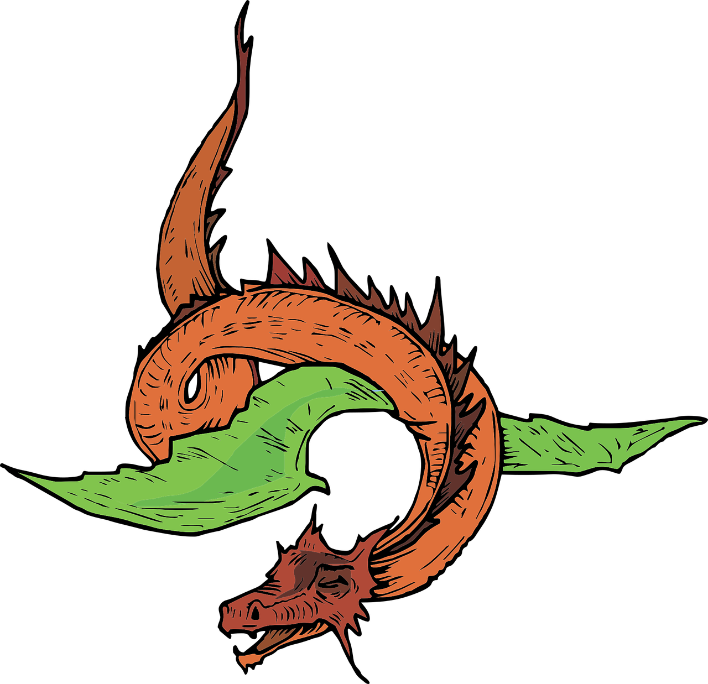

# Tiny Lang

<center>
    
</center>

Tiny Lang is a toy programming language. It'll soon support compiling to WASM.

## Install

```bash
git clone https://github.com/vivekascoder/tiny_lang
cd tiny_lang
cargo install --path .
```

## Run program

```bash
tiny_lang interpret ./examples/main.tiny
```

## Repl

```bash
tiny_lang repl --with (ast/lex/interpret)
```

## Compiler

To compile the tiny program into machine code use the following command.

```bash
tiny_lang compile ./examples/main.tiny
chmod +x ./a.out
./a.out
```

🗒️ NOTE: Make sure you have llvm installed in your system along with clang, as we rely on `llc` and `clang` to compile.

## Syntax highlighting for tiny programs

```
cp -r ./syntax ~/.vscode/extensions/
```

After restarting your VsCode, you'll have tiny lang syntax support.

## Examples

```
/**
* calculate sum of fibonacci sequence using tiny lang.
**/

fun fibo(num: usize) => usize {
    if (num == 0) {
        return 0;
    } else {
        if (num == 1) {
            return 1;
        } else {
            return fibo(num - 1) + fibo(num - 2);
        }
    }
}

print(fibo(15));
```

### For more exmaples.

Check out the [examples](./examples/) folder.
